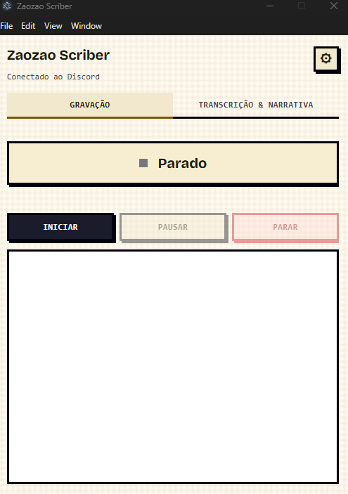
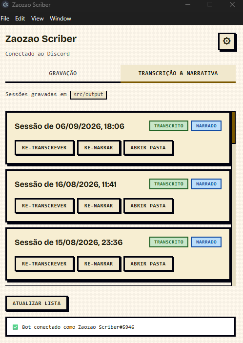
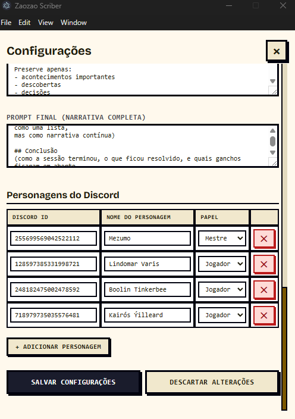
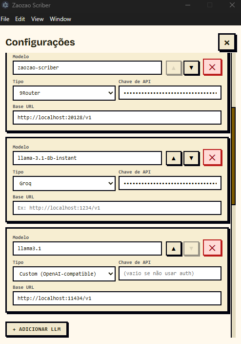
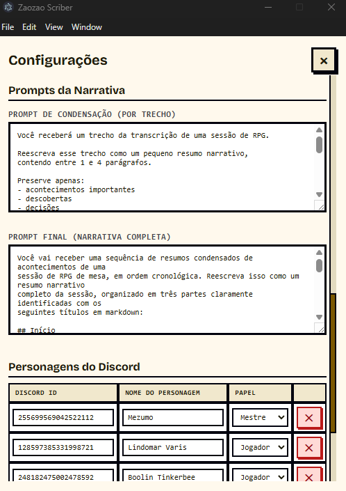
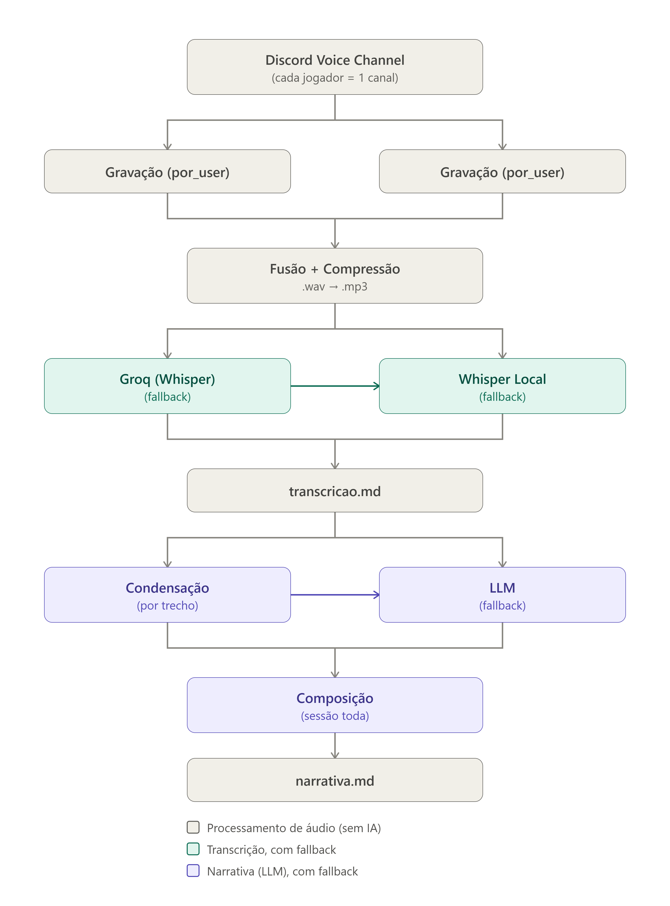
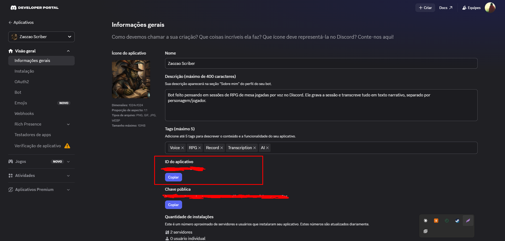
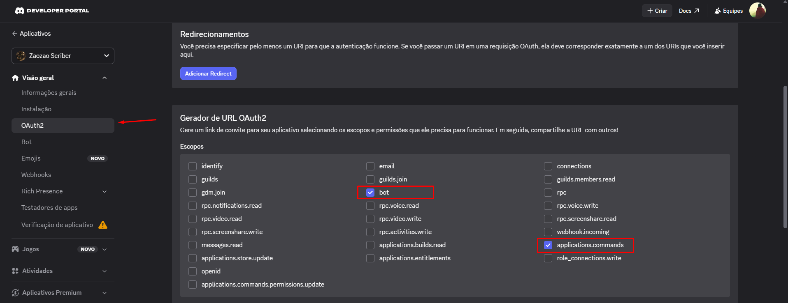
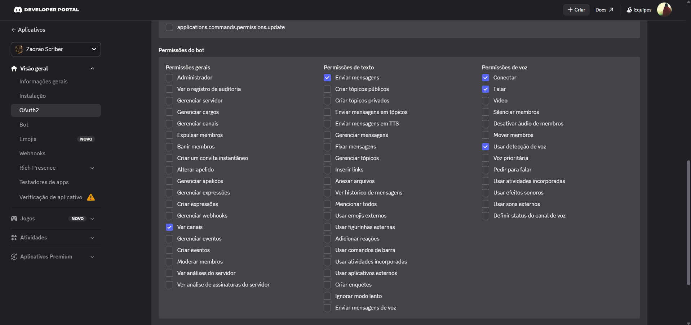

# ZaoZao Scriber

> Um bot para Discord que grava sessões de RPG por voz e transforma em narrativa literária.

---

## 📖 Sobre o Projeto

O **ZaoZao Scriber** resolve um problema real de mesas de RPG online: **ninguém consegue anotar tudo durante a sessão**. O bot entra no canal de voz do Discord, grava cada jogador separadamente, transcreve o áudio e gera automaticamente um `.md` com a narrativa completa da sessão — como um capítulo de livro de fantasia.

O projeto inclui tanto um **bot de Discord** (executado via terminal) quanto um **aplicativo desktop** com interface gráfica (Electron) para quem prefere uma experiência visual.

### Tech Stack

| Camada | Tecnologias |
|---|---|
| Bot & Lógica | Node.js, Discord.js |
| Gravação de voz | @discordjs/voice, @discordjs/opus, DAVE Protocol |
| Transcrição | Groq API (Whisper), Whisper Local |
| Narrativa (LLM) | Groq, 9Router, OpenRouter, Ollama, ou qualquer API OpenAI-compatible |
| Interface Desktop | Electron |
| Processamento de áudio | ffmpeg, wav |

> **Segurança:** Todas as chaves de API ficam no `.env` (gitignored) e são resolvidas via variáveis de ambiente. O `config.yaml` usa `${VAR}` para referenciá-las, nunca valores hardcoded.

---

## 🖼️ Interface do App

### Tela Principal — Gravação



### Transcrição & Narrativa



### Configurações







---

## ✨ Funcionalidades

- **Gravação por pessoa** — cada jogador é gravado em um canal separado, garantindo isolamento de áudio
- **Fusão inteligente** — fragmentos de áudio são unidos antes da transcrição, reduzindo processamento de horas para minutos
- **Transcrição em cascata** — fallback automático: Groq API → Whisper local, sem travar o processo
- **Narrativa automática** — gera um resumo literário estilo capítulo de fantasia, em duas etapas (condensação → composição)
- **Filtro de alucinações** — descarta silêncio, ruído e frases genéricas inventadas pelo Whisper
- **Interface gráfica** — app desktop com Electron para gravar, pausar, transcrever e narrar com botões
- **Fallback de LLM** — cascade configurável com múltiplos provedores (Groq, 9Router, OpenRouter, Ollama, ou qualquer API compatível com OpenAI)

---

## 🏗️ Arquitetura



---

## 🚀 Como Executar

### Pré-requisitos

- [Node.js](https://nodejs.org/) 18+
- Uma conta no [Discord Developer Portal](https://discord.com/developers/applications)
- Chave de API da [Groq](https://console.groq.com/keys)

### Instalação

```bash
# Clone o repositório
git clone https://github.com/SEU-USUARIO/zaozao-scriber.git
cd zaozao-scriber

# Instale as dependências
npm install

# Configure as variáveis de ambiente
cp .env.example .env
# Edite .env com suas credenciais

# Configure o config.yaml
cp config.example.yaml config.yaml
# Edite config.yaml com seus provedores e prompts
```

### Configuração do Bot no Discord

#### 1. Criar a aplicação

1. Acesse o [Discord Developer Portal](https://discord.com/developers/applications)
2. Clique em **New Application** (canto superior direito)
3. Dê um nome (ex: "ZaoZao Scriber") e clique em **Create**

---

#### 2. Copiar o Application ID

1. No menu lateral, vá em **General Information**
2. Copie o **Application ID** — esse é o seu `CLIENT_ID`



---

#### 3. Criar o bot

1. No menu lateral, vá em **Bot**
2. Clique em **Add Bot** (se ainda não tiver um bot criado)
3. Em seguida, clique em **Reset Token** e copie o token gerado
   > ⚠️ Esse token é o `DISCORD_TOKEN` do seu `.env`. Ele **não será mostrado novamente** — guarde em local seguro.

---

#### 4. Ativar Privileged Gateway Intents

Na mesma aba **Bot**, role para baixo até **Privileged Gateway Intents** e ative **APENAS**:

- [x] **Server Members Intent**
- [x] **Message Content Intent**

> **Não ative** `Presence Intent` — não é necessário para este projeto.

---

#### 5. Gerar o link de convite do bot

1. No menu lateral, vá em **OAuth2**
2. Clique na aba **URL Generator**
3. Em **Scopes** (metade de cima da página), marque **apenas**:
   - [x] `bot`
   - [x] `applications.commands`
4. Em **Bot Permissions** (metade de baixo da página), marque **apenas**:
   - [x] `Connect`
   - [x] `Speak`
   - [x] `Use Voice Activity`
   - [x] `Send Messages`
   - [x] `View Channels`
5. Copie a **Generated URL** que aparece no final da página





---

#### 6. Convidar o bot para o servidor

1. Abra a URL copiada no navegador
2. No pop-up do Discord, selecione o servidor onde quer adicionar o bot
3. Clique em **Authorize**
   > Você precisa ter permissão de **"Gerenciar Servidor"** no Discord para convidar bots.

---

#### 7. Copiar o Guild ID

1. Abra o **Discord** (app ou navegador)
2. Vá em **Configurações de Usuário** (ícone de engrenagem, embaixo à esquerda)
3. No menu lateral, vá em **Avançado** e ative o **Modo Desenvolvedor**
4. Volte ao Discord e **botão direito** no ícone do seu servidor
5. Clique em **Copiar ID do Servidor**

---

### Resumo: O que vai no `.env`

| Variável | Onde encontrar |
|---|---|
| `DISCORD_TOKEN` | Developer Portal → Bot → Token (passo 3) |
| `CLIENT_ID` | Developer Portal → General Information → Application ID (passo 2) |
| `GUILD_ID` | Discord → botão direito no servidor → Copiar ID (passo 7) |
| `GROQ_API_KEY` | https://console.groq.com/keys |
| `NINE_ROUTER_API_KEY` | (opcional) chave do 9Router, se usar |

```env
DISCORD_TOKEN=seu_token_aqui
CLIENT_ID=seu_application_id
GUILD_ID=id_do_seu_servidor
GROQ_API_KEY=sua_chave_groq
NINE_ROUTER_API_KEY=sua_chave_9router
```

### Registre os comandos

```bash
npm run register
```

### Execute

```bash
# Bot via terminal
npm start

# Ou app desktop (Electron)
npm run app
```

### Transcrever e gerar narrativa (via terminal)

Depois de gravar uma sessão, o pipeline de transcrição e narrativa pode ser rodado diretamente pela CLI:

```bash
# Pipeline completo: fusão → transcrição → narrativa
npm run transcribe -- "src/output/sessao-XXXX"

# Rodar só a narrativa (sem refazer a transcrição)
npm run narrate -- "src/output/sessao-XXXX"
```

Substitua `sessao-XXXX` pelo nome da pasta da sessão em `src/output/`.

---

## 📁 Estrutura do Projeto

```
zaozao-scriber/
├── src/
│   ├── index.js                  # Ponto de entrada do bot
│   ├── botServer.js              # Servidor HTTP local (comunica com Electron)
│   ├── registerCommands.js       # Registra slash commands no Discord
│   ├── config.js                 # Carrega config.yaml
│   ├── paths.js                  # Resolução de caminhos (dev vs packaged)
│   ├── transcribe.js             # Orquestrador: merge → transcrição → narrativa
│   ├── narrate.js                # Lógica de condensação + composição
│   ├── narrateOnly.js            # Roda só a etapa de narrativa
│   ├── mergeAudio.js             # Fusão + compressão de áudios por pessoa
│   ├── characters.json           # Mapeamento ID Discord → nome do personagem
│   ├── commands/
│   │   └── sessao.js             # /sessao iniciar | parar
│   ├── voice/
│   │   └── recordAudio.js        # Conexão de voz e gravação por usuário
│   └── providers/
│       ├── transcribeGroq.js     # Transcrição via Groq API
│       ├── transcribeLocal.js    # Transcrição via Whisper local
│       ├── transcribeFallback.js # Orquestra Groq → Whisper local
│       └── transcribeCustom.js   # Transcrição via API OpenAI-compatible
├── electron/                     # App desktop (Electron)
│   ├── main.js                   # Processo principal
│   ├── preload.cjs               # Bridge seguro entre renderer e main
│   └── renderer/
│       ├── index.html            # Interface gráfica
│       └── renderer.js           # Lógica da UI
├── config.yaml                   # Provedores e prompts (gitignored)
├── config.example.yaml           # Template de configuração
├── .env.example                  # Template de variáveis de ambiente
├── package.json
└── README.md
```

---

## ⚙️ Configuração

### `config.yaml`

Controla qual provedor cada etapa usa e os prompts de narrativa:

```yaml
transcription:
  provider: fallback
  chain:
    - type: groq
      model: whisper-large-v3-turbo
      api_key: ""
      base_url: ""
  local:
    model: small

narrative:
  enabled: true
  chain:
    - type: groq
      model: llama-3.1-8b-instant
      api_key: ${GROQ_API_KEY}
      base_url: ""
    - type: custom
      model: llama3.1
      api_key: ""
      base_url: http://localhost:11434/v1
  condense_prompt: |
    (seu prompt de condensação aqui)
  final_prompt: |
    (seu prompt de narrativa aqui)
```

> As chaves de API usam `${VAR}` para ler do `.env`. Nunca coloque chaves hardcoded no `config.yaml`.

#### Provedores de LLM suportados

O sistema usa uma **cadeia de fallback** — se um provedor falhar (rate limit, erro, indisponibilidade), o próximo é tentado automaticamente. A ordem é definida no `config.yaml`:

| Tipo | Provedor | Exemplo de uso | Requer API key? |
|---|---|---|---|
| `groq` | Groq API | Cloud rápido e gratuito | Sim (via `.env` ou config) |
| `9router` | 9Router | Proxy local/privado | Depende da config |
| `openrouter` | OpenRouter | Cloud, múltiplos modelos | Sim |
| `ollama_cloud` | Ollama Cloud | Plano gratuito da Ollama | Não |
| `ollama_local` | Ollama Local | Instância local via Ollama | Não |
| `custom` | Qualquer API OpenAI-compatible | Together AI, Anthropic via proxy, etc. | Sim |

**Exemplo de cadeia com 9Router como primeiro provedor:**

```yaml
narrative:
  chain:
    - type: 9router
      model: zaozao-scriber
      api_key: sua-chave
      base_url: http://localhost:20128/v1
    - type: groq
      model: llama-3.1-8b-instant
      api_key: ""
    - type: custom
      model: llama3.1
      base_url: http://localhost:11434/v1
```

Neste exemplo: 9Router → Groq → Ollama local.

**Exemplo com OpenRouter:**

```yaml
narrative:
  chain:
    - type: openrouter
      model: meta-llama/llama-3.1-8b-instant
      api_key: sk-or-...
      base_url: https://openrouter.ai/api/v1
```

**Exemplo com qualquer API compatível (Together AI, LM Studio, etc.):**

```yaml
narrative:
  chain:
    - type: custom
      model: meta-llama/Meta-Llama-3.1-8B-Instruct
      api_key: sua-chave
      base_url: https://api.together.xyz/v1
```

> **Nota:** A transcrição (Whisper) suporta apenas `groq`, `local` (Whisper local) e `custom` (API OpenAI-compatible). A narrativa (LLM) suporta todos os tipos acima.

### `src/characters.json`

Mapeia IDs do Discord para nomes de personagens:

```json
{
  "ID_DO_DISCORD": {
    "name": "Nome do Personagem",
    "role": "player"
  }
}
```

- `role: "player"` → fala aparece como `**Nome:** texto`
- `role: "master"` → fala aparece como narração: `> **Nome (Master):** texto`

---

## 🔧 Decisões Técnicas

### Por que fundir áudios antes de transcrever?

A gravação corta um arquivo novo a cada ~1s de silêncio, gerando centenas de fragmentos. Cada chamada de transcrição tem custo fixo independente do tamanho — transcrever 3.500 fragmentos de <1s levava ~3h de overhead. Fundindo, o custo é pago uma vez por pessoa, não uma vez por frase.

### Fallback em cascata

```
Transcrição:  Groq (mp3)  →  Whisper local (wav)
Narrativa:    Qualquer provedor configurado → Próximo → Próximo → ...
```

A cadeia de narrativa é totalmente configurável — você define a ordem dos provedores no `config.yaml`. Esperas curtas de rate limit são absorvidas com retry; esperas longas fazem o processo cair para o próximo nível automaticamente.

### Narrativa em duas etapas (map-reduce)

1. **Condensar**: cada pedaço da transcrição (~6.000 chars) é resumido isoladamente
2. **Compor**: todos os resumos são enviados numa única chamada que escreve a narrativa completa com início, meio e fim

Isso permite processar sessões inteiras sem exceder o contexto do LLM.

---

## 🗺️ Roadmap

- [ ] Resumo automático via comando `/sessao resumo`
- [ ] Detecção automática de personagens novos
- [ ] Suporte a múltiplos servidores simultaneamente

---

## 📋 Solução de Problemas

| Sintoma | Causa | Solução |
|---|---|---|
| `/sessao` não aparece | Comando registrado em servidor diferente | Confirmar `GUILD_ID` |
| Voz presa em `Signalling` | Firewall bloqueando UDP | Adicionar `node.exe` às exceções |
| `.wav` mudo para alguém | Cliente Discord desatualizado | Atualizar o app do Discord |
| `429` na Groq | Rate limit | Fallback já lida automaticamente |
| `api_key` vazio no provider | Variável de ambiente não definida no `.env` | Verificar se a variável existe e está correta |

---

## 📄 Licença

Este projeto está sob a licença MIT. Veja o arquivo [LICENSE](LICENSE) para mais detalhes.
